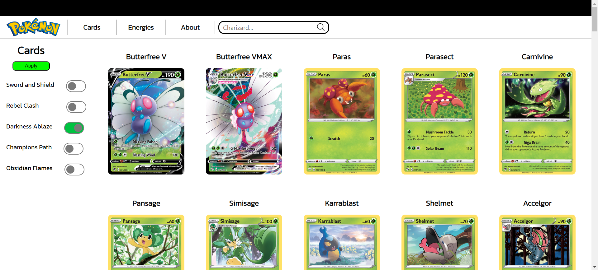

# Pokémon Card Explorer
Welcome to Pokémon Card Explorer, a web application built with Angular and TypeScript that lets you explore a vast collection of Pokémon cards. This project harnesses the power of the Pokémon TCG API to seamlessly fetch and display card images along with detailed statistics.

# Features

**Dynamic Display:** Browse through a diverse range of Pokémon cards with ease.

**Filtering Options:** Tailor your exploration by filtering cards based on set names, card names, and more.

**Interactive UI:** Enjoy a user-friendly interface that enhances your overall experience.

**Angular-Powered:** Leveraging the Angular framework for a robust and responsive web application.

**TypeScript Integration:** Enhance code maintainability and scalability with TypeScript.

# Getting Started
Clone this repository.

Install dependencies using npm install.

Run the application with ng serve.

Open your browser and navigate to http://localhost:4200/.

Explore the Pokémon Card Explorer and dive into the captivating world of Pokémon trading cards like never before!
